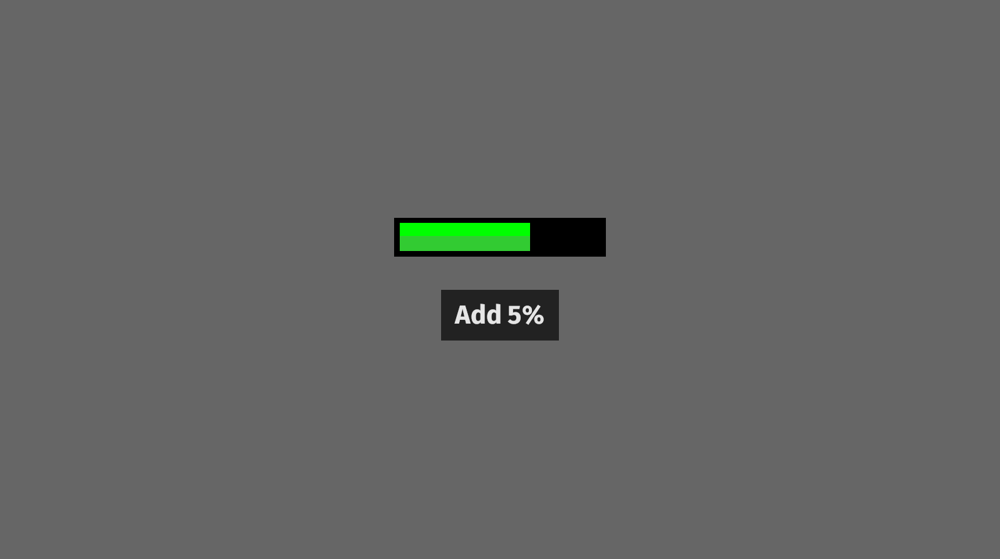

# bevy_slimy_widgets
It's a collection of bevy_ui widgets.

## Usage
Simply add [`SlimyWidgetsPlugin`](https://docs.rs/bevy_slinet/latest/bevy_slimy_widgets/struct.SlimyWidgetsPlugin.html)
with [`App::add_plugin()`](https://docs.rs/bevy/latest/bevy/app/struct.App.html#method.add_plugin)
and spawn UI node bundles from `bevy_simy_widgets`

## Widgets
#### Progress bar
[Example](examples/progress_bar.rs)

#### Text input
Note:
- Text wrapping is not implemented. (it should be implemented in bevy, not in a 3rd party plugin)
- Tabs (\t) don't work in bevy.

[Example](examples/text_input.rs)

### Compatibility table
| Plugin Version | Bevy Version |
|----------------|--------------|
| `main`         | `0.6`        |
